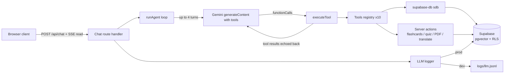

# Makerpreneur Study Hub

A study platform for university students that turns uploaded course material into an intelligent study assistant: RAG chat, flashcards, quizzes, exam-readiness scoring, past-paper analysis, and generated exam PDFs. The chat layer is powered by a hand-rolled Gemini function-calling agent with 10 tools, streaming results to the browser over SSE.

Built with Next.js 16 (App Router), the `@google/genai` SDK, and Supabase (Postgres + pgvector + Row Level Security). All application code lives in `myapp/app/study/`.

## Problem

Students sit on a pile of lecture notes, past papers, and slides, but the material is unstructured and unsearchable. Finding the formula for a specific exam question means re-reading hundreds of pages. Existing study apps force students into someone else's curriculum or require manual flashcard entry, and generic chatbots answer from the open web instead of the student's own material.

## Target user

A university student who wants to study from their own uploaded lecture notes and past papers: ask questions against the material, generate flashcards and quizzes, get an exam-readiness score with a study plan, translate explanations into Bahasa Melayu or English, and download a practice exam as a PDF.

## Features

- **Agentic chat (Study Buddy).** A Gemini function-calling loop with 10 tools: `search_material`, `search_memory`, `save_memory`, `generate_flashcards`, `generate_quiz`, `get_exam_readiness`, `get_study_plan`, `search_past_papers`, `translate_text`, `generate_exam_paper`. The model probes, calls tools, and sees every result echoed back, up to 4 turns per request.
- **SSE streaming.** The chat endpoint streams `tool_start`, `tool_end`, `text`, and `done` events; the UI renders tool activity and token-by-token text as it arrives, with a RAG fallback if the agent fails.
- **RAG over your own material.** Query expansion, per-material pgvector search, and reciprocal rank fusion (RRF) to answer questions with numbered citations into your chunks.
- **LLM logging.** Every model call is logged with latency, token counts, and estimated cost. Dev logs to `logs/llm.jsonl`; production writes to a Supabase `llm_logs` table. `npm run analyze-logs` reports cost and usage per task.
- **Flashcards and quizzes.** AI-generated decks and quizzes from selected materials, with spaced-repetition due dates and graded attempts.
- **Exam readiness and planner.** A readiness score driven by quiz/attempt history and memories, plus a generated day-by-day study plan with exam countdown.
- **Past papers.** Upload past exam PDFs, extract questions, and predict high-frequency topics.
- **Exam PDF generation.** One-click generation of a practice exam paper as a PDF download.
- **Multi-modal input.** Chat accepts images (photos of questions) alongside text.
- **Owner-scoped data.** Row Level Security scopes every table to the signed-in user.

## Architecture



Flow: the browser POSTs a question to the SSE route, the agent loop asks Gemini (with tool definitions) for a response, executes any function calls in parallel, echoes all results back, and repeats until Gemini returns a plain-text answer, which is streamed to the client. All LLM calls pass through the logger.

## Key decisions

| Decision | Choice | Why |
|---|---|---|
| Agent orchestration | Hand-rolled function-calling loop | The loop is ~100 lines; a framework like LangGraph adds a dependency without adding capability |
| Tool execution | `Promise.all` over tool calls in one model turn | Tool calls in a turn are independent; runs all 10 tools in parallel |
| Chat transport | SSE over WebSocket | Readable stream, simple protocol, no socket state to manage |
| Tool backends | Server actions reused as tool `run` bodies | One implementation powers both the UI and the agent |
| Retrieval fusion | Reciprocal rank fusion over plain top-k | RRF is parameter-light and robust to score scale differences across searches |
| Query expansion | Gemini generates 3 paraphrases per question | Cheap diversity boost for recall on short exam-style queries |
| Logging | JSONL (dev) + Supabase table (prod) | Zero-infrastructure local debugging, persistent analytics in prod |
| LLM Gateway | OpenRouter (free model chain) with direct Gemini fallback | Maximize usage limits at zero cost while maintaining direct Gemini reliability |
| Database access | Supabase anon key + RLS, never the service role key | Server reads and writes stay scoped to the signed-in user |
| Embeddings storage | pgvector in Postgres | No separate vector database to operate; same engine as the app data |

## Limitations

- Agent is capped at 4 turns per request; long multi-tool workflows can hit the cap before a final answer.
- Tool activity is surfaced as `tool_start`/`tool_end` events, not streamed inner text; a tool result that is itself long arrives as one block.
- Migrations are applied manually through the Supabase SQL editor, there is no migration runner.
- RLS ownership is baked into every query; the app is explicitly single-owner per subject, there is no sharing model.
- Logging only reaches Supabase in production builds (`NODE_ENV=production`).
- Gemini calls are rate-limited per model with a minimum gap; heavy parallel usage slows down.

## Getting started

Requires Node 20+ and a Supabase project with pgvector, plus a Google AI (Gemini) API key.

```bash
cd myapp
npm install
cp .env.example .env   # fill in GEMINI_API_KEY, NEXT_PUBLIC_SUPABASE_URL, NEXT_PUBLIC_SUPABASE_ANON_KEY
npm run dev            # http://localhost:3000
```

Apply the SQL migrations in `app/study/_sql/0001*.sql` through `0010*.sql` in order, using the Supabase SQL editor.

```bash
npm test               # vitest, unit tests under app/study/_lib/ai/
npm run lint           # eslint
npm run analyze-logs   # cost and usage report from llm_logs
```

## Sample chat transcript

User selects "Statistics" material and asks: "Generate 5 flashcards on Bernoulli trials."

```
user:    Generate 5 flashcards on Bernoulli trials.
agent:   [tool_start] generate_flashcards
agent:   [tool_end] generate_flashcards (1.2s)
agent:   Done! Here are 5 flashcards on Bernoulli trials:

         1. Q: What is a Bernoulli trial?
            A: An experiment with exactly two outcomes (success/failure)
            and a constant success probability p on each repetition.

         2. Q: What is the mean of a Bernoulli(p) random variable?
            A: E[X] = p.

         3. Q: What is the variance of a Bernoulli(p) random variable?
            A: Var[X] = p(1 - p).

         4. Q: What distribution describes n independent Bernoulli trials?
            A: The binomial distribution Bin(n, p).

         5. Q: What is P(X = k) for a binomial variable?
            A: C(n, k) p^k (1 - p)^(n - k).

         The deck "Bernoulli trials" was saved to your flashcards.
```

Under the hood the agent sent Gemini one function call, executed the flashcard action against the selected material, echoed the result back, and Gemini composed the answer from it.
